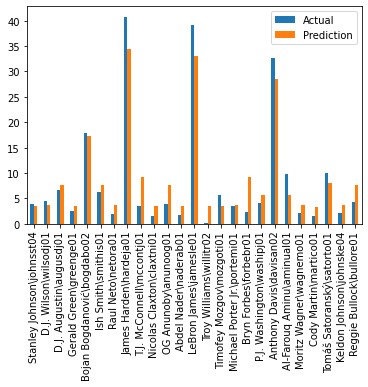

# NBA Salary Prediction

Задача: на основе статистики игрока NBA за несколько лет определить его зарплату.

Данные были взяты с сайта: https://www.basketball-reference.com

Было проведен анализ данных, подготовка, а также сравнение используемых для регрессии моделей.
В качестве выбранной выступает AdaBoostRegressor + DecisionTreeRegressor.

| Метрика | Резултат |
| ----- | ----- |
| R2 | 0.736 |
| MeanAbsError | 0.341 | 

Сравнение предсказанных и реальных зарплат проверяемого датасета:

[Подробнее](docs/it.pdf).
